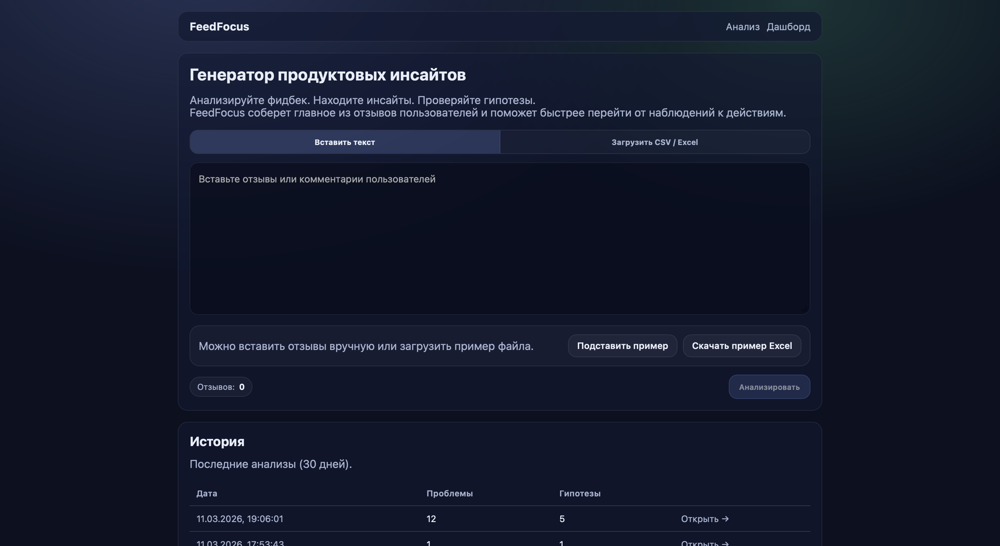
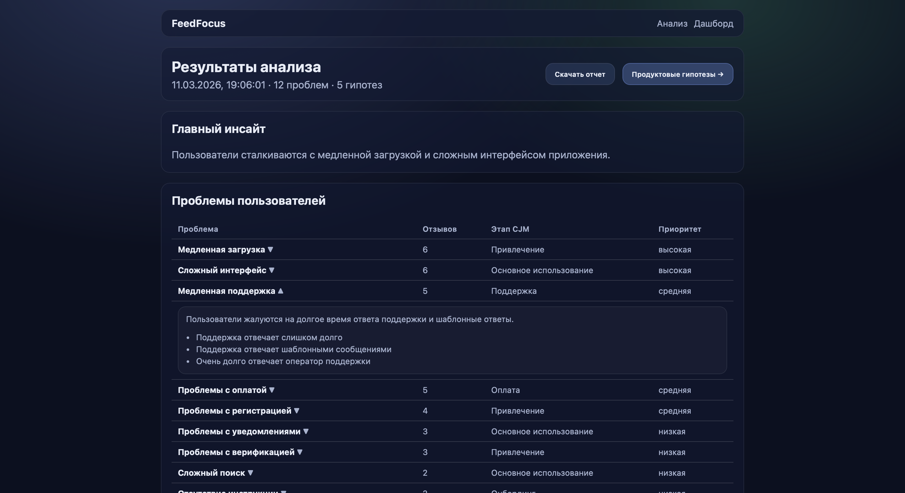
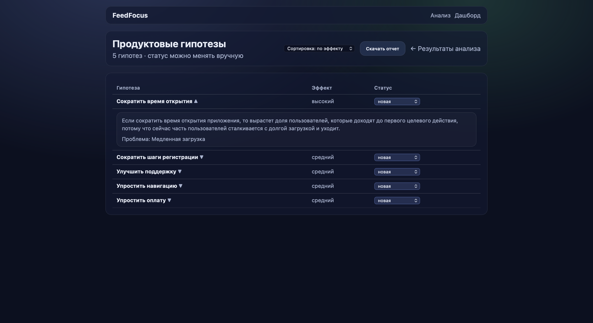
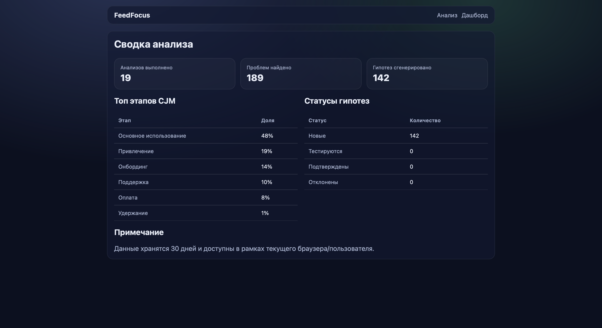

# FeedFocus

FeedFocus — сервис, который превращает пользовательский фидбек в структурированные инсайты и продуктовые гипотезы.

## Демо

- Продукт: `https://feedfocus-one.vercel.app`
- Репозиторий: `https://github.com/iDaveX/feedfocus`

## Что решает продукт

Продуктовые команды получают много пользовательского фидбека из разных источников: отзывы, комментарии, support-обращения, результаты интервью. Обычно этот поток приходится разбирать вручную: читать, группировать, искать повторяющиеся проблемы и формулировать гипотезы.

FeedFocus помогает пройти этот путь быстрее:

- собрать отзывы в одном месте
- выделить повторяющиеся проблемы пользователей
- соотнести проблемы с этапами CJM
- сформулировать гипотезы для проверки
- посмотреть сводную картину в dashboard

## Как работает

1. Пользователь вставляет отзывы вручную или загружает CSV / Excel.
2. FeedFocus анализирует фидбек и выделяет ключевые проблемы пользователей.
3. Сервис формирует главный инсайт и продуктовые гипотезы.
4. Пользователь может менять статус гипотез и смотреть агрегированную сводку в dashboard.

## Что уже реализовано

- ручной ввод отзывов
- загрузка CSV / XLSX
- выделение ключевых проблем пользователей
- классификация проблем по этапам CJM
- генерация продуктовых гипотез
- изменение статусов гипотез
- история анализов
- dashboard со сводными метриками
- экспорт отчёта в PDF

## Продуктовый фокус

FeedFocus задуман как MVP для проверки гипотезы: готовы ли product managers, founders и researchers использовать простой AI-инструмент, который помогает быстрее переходить от неструктурированного фидбека к конкретным продуктовым решениям.

## Интерфейс

### Главная страница



### Результаты анализа



### Продуктовые гипотезы



### Сводка анализа



## Технологии

- Next.js
- Supabase
- Groq
- PostHog
- Vercel

## Запуск локально

```bash
npm install
npm run dev
```

Проверка окружения и Supabase:

```bash
GET /api/health
```

## Production env

- `SUPABASE_URL`
- `SUPABASE_SERVICE_ROLE_KEY`
- `GROQ_API_KEY`
- `NEXT_PUBLIC_POSTHOG_KEY` (опционально)
- `NEXT_PUBLIC_POSTHOG_HOST` (опционально)

Шаблон env: `.env.production.example`  
Инструкция деплоя: `DEPLOY.md`
